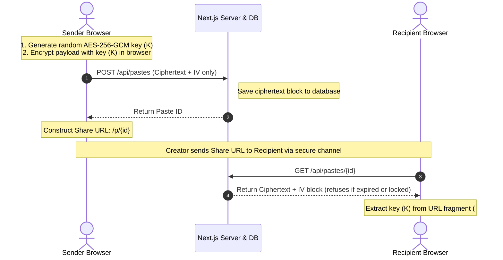

<div align="center">
  
  <h1>🔐 CipherDrop</h1>
  <p><strong>Absolute Zero-Knowledge. Cryptographically Secure. Seamlessly Simple.</strong></p>
  <p>
    <a href="#features">Features</a> •
    <a href="#architecture">Architecture</a> •
    <a href="#security-model">Security Model</a> •
    <a href="#getting-started">Getting Started</a>
  </p>

  
  
  
  
</div>

---

**CipherDrop** is a minimalist, military-grade client-side encrypted online pastebin and digital vault. 

It guarantees absolute privacy. Text content, source code, attachments, sketches, and voice notes are encrypted and decrypted directly within your browser using **256-bit AES in Galois/Counter Mode (AES-256-GCM)**. The server *never* receives or has knowledge of your decryption keys or the plaintext payload.

If you don't have the key, it's just math.

---

## ✨ Cutting-Edge Features

CipherDrop goes beyond a standard pastebin. We've built an arsenal of advanced cryptographic and security mechanisms to protect your data under any adversary model.

### 🛡️ Core Cryptography
*   **Zero-Knowledge Encryption:** Encrypts and decrypts entirely client-side using the native Web Crypto API.
*   **Shamir's Secret Sharing (SSS) Vault:** Split a master decryption key into $M$ parts. Require $N$ parts to reconstruct the key and unlock the vault. Executed entirely inside browser memory.
*   **Plausible Deniability Decoys:** Generate double ciphertexts (real/decoy). The payload that decrypts depends entirely on the password entered.

### 🚨 Active Defense & Self-Destruct
*   **Burn-After-Read Warning:** Features a 10-second visual countdown and synthesized audio alarm sweeps before permanently melting the text to random characters at 0s.
*   **Wrong Password Auto-Destruct:** The server actively tracks incorrect decryption attempts. Exceed the maximum threshold, and the database record is permanently purged.
*   **Duress Self-Destruct Switch:** Entering a specific Duress PIN in the management panel instantly annihilates all database records tied to the payload.
*   **Whistleblower Dead Man Switch:** The server refuses ciphertext delivery until a countdown timer expires. Keyholders must periodically "check-in" to reset the timer.
*   **Honeypot Intrusion Detection:** Set up tripwires to detect unauthorized access attempts on your links.

### 🤖 Intelligent Security & Delivery
*   **Security Recommendation Engine:** Local Regex-based PII scanner that audits your payload for SSNs, API keys, phone numbers, and emails *before* encryption.
*   **Steganography Link Encoder:** Uses the client-side Canvas API to invisibly encode your ciphertext URL inside the Least Significant Bits (LSB) of an image.
*   **OTP (One-Time Password) Delivery:** Secure secondary verification channels for link access.
*   **AI Persona Agents:** Interact with specialized agents (like Shinchan & Spiderman) for engaging, customized platform assistance.

### 💬 Secure Communication
*   **E2E Polling Chat Room:** Fully end-to-end encrypted client-to-client chat with localized server-side message polling.
*   **Voice Notes & Sketchpad:** Native browser container recording (WebM/MP4) and Canvas sketchpad, encrypting the raw binary blobs instantly.

---

## 🏗️ System Architecture

CipherDrop enforces absolute zero-knowledge confidentiality by keeping the cryptographic key in the **URL hash fragment (`#`)**. 

In accordance with RFC 3986, browsers do **not** transmit hash fragments to servers in HTTP request headers. Consequently, the encryption key remains strictly local in the recipient's browser.

### Data Split: What Goes Where?

| Data Layer | Location | Server Access | Technical Details |
|---|---|---|---|
| **Decryption Key (`#key`)** | Client Browser only | ❌ Never Sent | Stored in the browser URL hash fragment (`#`). |
| **Ciphertext Payload** | SQLite Database | 👁️ Encrypted Only | AES-256-GCM block of text, files, or drawings. |
| **Initialization Vector (IV)** | SQLite Database | 👁️ Visible | 12-byte random IV used to initialize the block cipher. |
| **Security Gates Metadata** | SQLite Database | 👁️ Visible | Expiration timestamp, SSS parameters, OTP config. |

### Cryptographic Flow Diagram



---

## 🔐 Technical Security Model

1.  **Cipher Algorithm**: AES-256-GCM (Galois/Counter Mode). Provides both confidentiality and integrity verification (authenticated encryption).
2.  **Key Derivation**: If a user password is set, keys are derived in-browser using **PBKDF2** (Password-Based Key Derivation Function 2) with SHA-256 hashing and 100,000 iterations, shielding the key from GPU-accelerated brute-force attacks.
3.  **Randomness**: IVs and salt buffers are generated using `window.crypto.getRandomValues()`, guaranteeing high-entropy cryptographic randomness natively from the OS.

---

## 🛠️ Technology Stack

*   **Framework:** Next.js 16 (App Router, Turbopack)
*   **Language:** TypeScript
*   **Database:** SQLite (via better-sqlite3)
*   **UI & Animation:** Vanilla CSS, Tailwind CSS v4, Lucide React, Canvas Confetti
*   **Audio Synthesis:** Web Audio API `AudioContext`
*   **Cryptography:** Web Crypto API

---

## 🚀 Getting Started

### 1. Install Dependencies
```bash
npm install
```
*(Note: If you encounter native build errors with SQLite on Windows/Node 24, you can bypass the build by using `npm install --ignore-scripts`)*

### 2. Run the Development Server
```bash
npm run dev
```
Open **[http://localhost:3000](http://localhost:3000)** in your browser to see the result.

### 3. Run Automated System Integration Tests
Execute the custom innovation scripts to test SSS threshold splits, decoy decryption, and dead man switch check-ins:
```bash
node .system_generated/tasks/test-innovations.js
```

---
<div align="center">
  <p>Built with privacy in mind. 🕶️</p>
</div>
