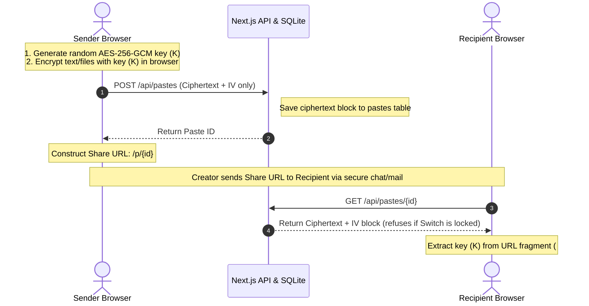

# 🔐 PrivateBin (CipherDrop Fork)

Current version: 2.0.6

**PrivateBin** is a minimalist, open source online pastebin where the server has zero knowledge of stored data. Data is encrypted and decrypted in the browser using 256bit AES in Galois Counter mode.

This is a fork of ZeroBin, originally developed by Sébastien Sauvage. PrivateBin was refactored to allow easier and cleaner extensions and has many additional features.

---

## What PrivateBin provides

* As a server administrator you don't have to worry if your users post content that is considered illegal in your country. You have plausible deniability of any of the pastes content. If requested or enforced, you can delete any paste from your system.
* Pastebin-like system to store text documents, code samples, etc.
* Encryption of data sent to server.
* Possibility to set a password which is required to read the paste. It further protects a paste and prevents people stumbling upon your paste's link from being able to read it without the password.

---

## What it doesn't provide

* As a user you have to trust the server administrator not to inject any malicious code. For security, a PrivateBin installation *has to be used over HTTPS*! Otherwise you would also have to trust your internet provider, and any jurisdiction the traffic passes through. Additionally the instance should be secured by HSTS, it can use traditional certificate authorities and/or use a DNSSEC protected DANE record.
* The "key" used to encrypt the paste is part of the URL (in the fragment part separated by the `#`). If you publicly post the URL of a paste that is not password-protected, anyone can read it. Use a password if you want your paste to remain private. In that case, make sure to use a strong password and share it privately and end-to-end-encrypted.
* A server admin can be forced to hand over access logs to the authorities. PrivateBin encrypts your text and the discussion contents, but who accessed a paste (first) might still be disclosed via access logs.
* In case of a server breach your data is secure as it is only stored encrypted on the server. However, the server could be abused or the server admin could be legally forced into sending malicious code to their users, which logs the decryption key and sends it to a server when a user accesses a paste. Therefore, do not access any PrivateBin instance if you think it has been compromised. As long as no user accesses this instance with a previously generated URL, the content can't be decrypted.

---

## Options

Some features are optional and can be enabled or disabled in the configuration file:

* Password protection
* Discussions, anonymous or with nicknames and IP based identicons or vizhashes
* Expiration times, including a "forever" and "burn after reading" option
* Markdown format support for HTML formatted pastes, including preview function

---

# 🚀 Advanced Innovations & Custom Extensions (CipherDrop)

This fork (CipherDrop) extends the core PrivateBin protocol with additional high-impact security features:

1. **Plausible Deniability Decoy Vaults**: Enable decoy mode to set two separate passwords. Password A decrypts the genuine secret, while Password B decrypts an innocuous decoy note.
2. **Coercion Duress PIN (Self-Destruct)**: Senders configure a secondary Duress PIN. Querying the dashboard with this PIN silently deletes the database record immediately while displaying a dummy active status as cover.
3. **Time-Locked CPU Puzzle**: Recipient browsers solve a verifiable CPU repeated hashing delay puzzle for 4 seconds before revealing the note content, making brute-force dictionary attacks mathematically unfeasible.
4. **Air-Gapped Animated QR Stream**: Loops decryption keys through 3 blinking QR code packets every 450ms, allowing local data transfers to mobile camera receivers without network packets.
5. **E2E Encrypted Draw Sketchpad**: Draw diagrams, mockups, or signatures directly on an interactive canvas board. The sketch is fully encrypted client-side alongside your text secrets.
6. **Wrong Password Guess Limit (Rate-Limit Shield)**: Senders set a retry attempt limit. If the recipient enters the incorrect password too many times, the paste silently auto-destructs immediately.
7. **Geographic IP Region fences**: Restricts paste decryption to specific country codes (e.g. `US, IN`) and displays reader access attempt log history details in the management dashboard.
8. **Whistleblower Dead Man's Switch**: Refuses ciphertext delivery completely until the countdown timer expires. The creator can reset the timer using a check-in key pre-populated inside the management panel.
9. **Shamir's Secret Sharing (SSS) Threshold Vaults**: Splits the master AES decryption key into $M$ distinct shares, requiring at least $N$ shares to combine client-side to decrypt the note.
10. **Covert Steganography Drop**: Encodes paste URLs and keys directly inside the LSB pixels of generated or custom uploaded PNG images.
11. **Real-time Scrambler Matrix**: Mono-space visual byte terminal scrambling characters next to the editor text area in real-time.
12. **Voice Notes memo**: In-browser audio recording E2E encrypted client-side.
13. **Slack Botcommand Simulator**: Automated `/secret` commands encrypting payloads server-side with SubtleCrypto compatibility.

---

## 🏗️ System Architecture

CipherDrop enforces E2E Zero-Knowledge confidentiality by storing the cryptographic keys in the **URL hash fragment (`#`)**. In accordance with RFC 3986, browsers do **not** transmit hash fragments to servers during HTTP requests. Consequently, the key never touches the network or database.

### Cryptographic Flow Diagram



---

## 🛠️ Technology Stack

- **Framework**: Next.js 15 (App Router, Turbopack, TypeScript)
- **Database**: SQLite with WAL mode (Write-Ahead Logging) for concurrent SQLite performance
- **UI & Animation**: Tailwind CSS v4, Lucide React, Canvas Confetti
- **Crypto Engine**: Web Crypto API (AES-GCM 256, PBKDF2 key derivation, client-side SSS GF(256) polynomial math)

---

## 🚀 How to Run Locally

### 1. Run the Development Server
```bash
npm run dev
```
Open **[http://localhost:3000](http://localhost:3000)** in your browser.

### 2. Run API Validation Tests
Verify SSS, decoy vaults, whistleblower switch timers, E2E chat polls, and Slack bot webhooks:
```bash
node .system_generated/tasks/test-innovations.js
```
